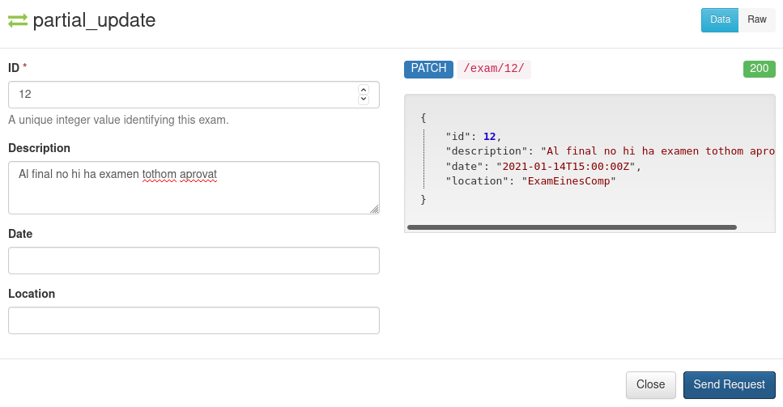

# Table of Contents

1.  [Coses a preguntar](#org5dfa4a0)
2.  [Notes de desenvolupament](#org25031b2)
3.  [Arquitectura](#orge9c9b57)
    1.  [Bàsics](#org8e43138)
    2.  [Advanced](#org92ca6d4)
    3.  [Integració](#orge985253)

<table id="org5be7804" border="2" cellspacing="0" cellpadding="6" rules="groups" frame="hsides">

<colgroup>
<col  class="org-left" />

<col  class="org-left" />

<col  class="org-left" />

<col  class="org-left" />
</colgroup>
<thead>
<tr>
<th scope="col" class="org-left">Method</th>
<th scope="col" class="org-left">URL</th>
<th scope="col" class="org-left">What</th>
<th scope="col" class="org-left">Status code</th>
</tr>
</thead>

<tbody>
<tr>
<td class="org-left">get</td>
<td class="org-left">exam/</td>
<td class="org-left">List d&rsquo;exams</td>
<td class="org-left">200</td>
</tr>

<tr>
<td class="org-left">get</td>
<td class="org-left">exam/{exam}/</td>
<td class="org-left">Detall de Exam (tot)</td>
<td class="org-left">200, 404</td>
</tr>

<tr>
<td class="org-left">get</td>
<td class="org-left">exam/search?description={text}/</td>
<td class="org-left">Buscar descripció parcial.</td>
<td class="org-left">200</td>
</tr>

<tr>
<td class="org-left">post</td>
<td class="org-left">exam/</td>
<td class="org-left">Crea exam. pk no s&rsquo;ha de donar.</td>
<td class="org-left">201, 403, 401</td>
</tr>

<tr>
<td class="org-left">put</td>
<td class="org-left">exam/{exam}/</td>
<td class="org-left">Modificar camps d&rsquo;Exam (tots)</td>
<td class="org-left">200, 403, 401</td>
</tr>

<tr>
<td class="org-left">patch</td>
<td class="org-left">exam/{exam}/</td>
<td class="org-left">Partial update.</td>
<td class="org-left">200, 403, 401</td>
</tr>

<tr>
<td class="org-left">delete</td>
<td class="org-left">exam/{exam}/</td>
<td class="org-left">Deletes if professor and no grades</td>
<td class="org-left">204, 403, 401</td>
</tr>
</tbody>

<tbody>
<tr>
<td class="org-left">post</td>
<td class="org-left">grades/</td>
<td class="org-left">Penjar nota d&rsquo;un examen.</td>
<td class="org-left">201, 403, 401</td>
</tr>

<tr>
<td class="org-left">get</td>
<td class="org-left">grades/{user}/user/</td>
<td class="org-left">List totes les notes d&rsquo;un estudiant.</td>
<td class="org-left">200</td>
</tr>

<tr>
<td class="org-left">get</td>
<td class="org-left">grades/</td>
<td class="org-left">List all grades.</td>
<td class="org-left">200</td>
</tr>

<tr>
<td class="org-left">get</td>
<td class="org-left">grades/{gradeid}</td>
<td class="org-left">Detail a grade.</td>
<td class="org-left">200, 404</td>
</tr>

<tr>
<td class="org-left">put</td>
<td class="org-left">grades/{gradeid}</td>
<td class="org-left">Updates a grade.</td>
<td class="org-left">200, 403, 401</td>
</tr>

<tr>
<td class="org-left">patch</td>
<td class="org-left">grades/{gradeid}</td>
<td class="org-left">Partially updates a grade.</td>
<td class="org-left">200, 403, 401</td>
</tr>

<tr>
<td class="org-left">delete</td>
<td class="org-left">grades/{gradeid}</td>
<td class="org-left">Deletes a grade.</td>
<td class="org-left">204, 403, 401</td>
</tr>
</tbody>

<tbody>
<tr>
<td class="org-left">post</td>
<td class="org-left">auth/login/</td>
<td class="org-left">Logins</td>
<td class="org-left">201, 403, 401</td>
</tr>

<tr>
<td class="org-left">get</td>
<td class="org-left">auth/logout/</td>
<td class="org-left">Logouts</td>
<td class="org-left">200</td>
</tr>

<tr>
<td class="org-left">post</td>
<td class="org-left">auth/logout/</td>
<td class="org-left">Logout</td>
<td class="org-left">201, 403, 401</td>
</tr>

<tr>
<td class="org-left">post</td>
<td class="org-left">auth/password/change/</td>
<td class="org-left">Password change.</td>
<td class="org-left">201, 403, 401</td>
</tr>

<tr>
<td class="org-left">post</td>
<td class="org-left">auth/password/reset/</td>
<td class="org-left">Password reset by email confirmation. Needs Email configuration</td>
<td class="org-left">201, 403, 401</td>
</tr>

<tr>
<td class="org-left">post</td>
<td class="org-left">auth/password/reset/confirm/</td>
<td class="org-left">Password Confirmation</td>
<td class="org-left">201, 403, 401</td>
</tr>

<tr>
<td class="org-left">post</td>
<td class="org-left">auth/registration/</td>
<td class="org-left">Register a new user.</td>
<td class="org-left">201, 403, 401</td>
</tr>

<tr>
<td class="org-left">post</td>
<td class="org-left">auth/registration/verify-email</td>
<td class="org-left">Verifies email. Needs Email configuration</td>
<td class="org-left">201, 403, 401</td>
</tr>

<tr>
<td class="org-left">get</td>
<td class="org-left">auth/user/</td>
<td class="org-left">Reads User. Needs authentication</td>
<td class="org-left">200</td>
</tr>

<tr>
<td class="org-left">put</td>
<td class="org-left">auth/user/</td>
<td class="org-left">Updates User</td>
<td class="org-left">200, 403, 401</td>
</tr>

<tr>
<td class="org-left">patch</td>
<td class="org-left">auth/user/</td>
<td class="org-left">Partial update.</td>
<td class="org-left">200, 403, 401</td>
</tr>
</tbody>

<tbody>
<tr>
<td class="org-left">get</td>
<td class="org-left">user/{user}/</td>
<td class="org-left">Gets user with pk.</td>
<td class="org-left">200, 404</td>
</tr>
</tbody>
</table>

# Screenshots

The screenshots are for the most important cases, there are endpoints
that has been omitted, like user password change.

Note that due to a bug in the docs viewer, as deleting an object only
returns a status code without any data, it does not correcly show that
the status code is 204. Instead, only shows "undefined", even though it
is properly deleted from the database.

## Authentication

- Register
  
- Login
  

## Exam

- List exams
  
- Create exam
  
- Read exam
  
- Update exam
  
- Patch exam
  
- Delete exam
  
- Search exam
  

## Grades

- List grades
  
- Create grade
  
- Read grade
  
- Update grade
  
- Patch grade
  
- Delete grade
  
- Search user grades
  
- Search exam grades
  

# How To

# Solution justification

## Web Service

### Technologies

- Django: We have chosen this technology because our familiarity with it and
  its ease to work with data models and ORM.
- Django rest framework: this framework is a powerfull and easy-to-use tool
  for building web REST API's, it includes mechanisms for searialization and
  authentication, which we found necessary.
- SQLite: it is the Django default database (a postgres database is also
  configured using docker)
- Docker: It facilitates the configuration and portabiltiy of the project.
- Docker-compose: It facilitates even more the configuration

### Decisions

- **Authentication**: we developed a simple autenticathon in which users
  once registered and logged are provided with a token that they will need
  to make specific api calls. There are custom permisions to prevent forbidden
  actions, like a student deleting an exam, or modifiying a grade.
  We used django_rest_auth, which provides endpoints for registration, authentication,
  password resset, retrieve and update user details, etc.

- **Get user**: <!-- TODO: S'ha de comentar? -->

## RMI modifications

- **HTTP**: We have made two adapter classes in order to encapsulate the http
  requests made to the web service by the client and the server.
  To make the request we have used OkHttp3, we were restricted to use a library
  from before java 8 because of RMI deprecation. We were unable to mock and
  test the api calls because OkHttp3 Request and Response object does not implement
  equals, and are final.
- **Client flow changes**: Now the client has to be identified in order to enter the
  exam session, so the first step is to ask for a correct user and password. Once
  authenticated correctly the user is given 3 options:

  - **search \<keywords>** : searches exams by its description and outputs the information of the matched exams.
  - **list** : lists and outputs all the exams and its information.
  - **choose \<id_exam>** : chose the desired exam in order to connect to its session.
    Once an exam is chosen, the flow works as before.

- **Server flow changes**: As happens with the client, the professor has to be identified in
  order to create an exam session, so the first step is to ask for a correct user and password.
  Once authenticated correctly it will be asked to introduce the following parametters in order
  to create the exam:
  - **description**: the desription of the exam.
  - **date**: the date of the exam, it needs a specific date format, as 2021-01-11T14:00:00Z.
  - **location**: the location of the exam (string). We decided that the location will be
    the bind key of the remote object that references that exact exam session.
    Once the last parammeter is filled, the exam will be created in the web service, as well as
    the session in which the students can connect to perform the exam. When the professor
    finnishes the exam all the grades are updated to the web service.

## Hours dedicated

It is difficult to say, but we estimate an approximate of 90 hours.
We are a group of three students, and we worked in this project
for 6 days, 5 hours each day.
